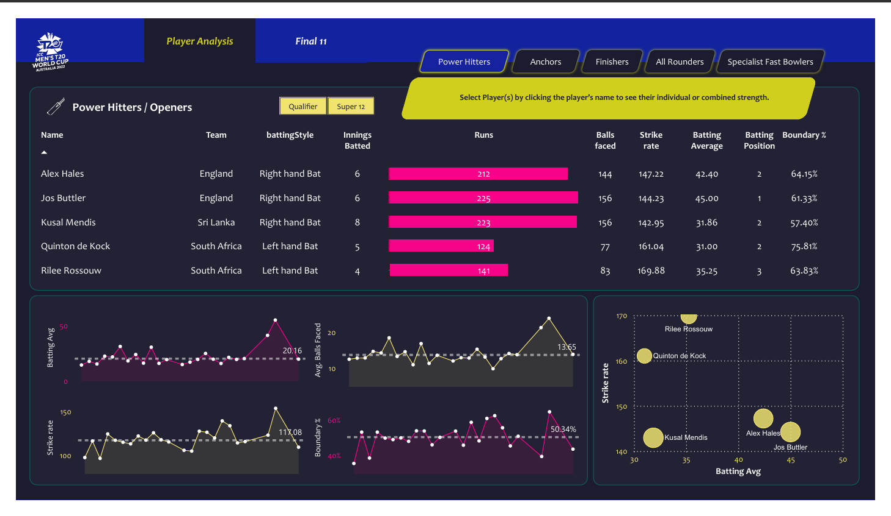
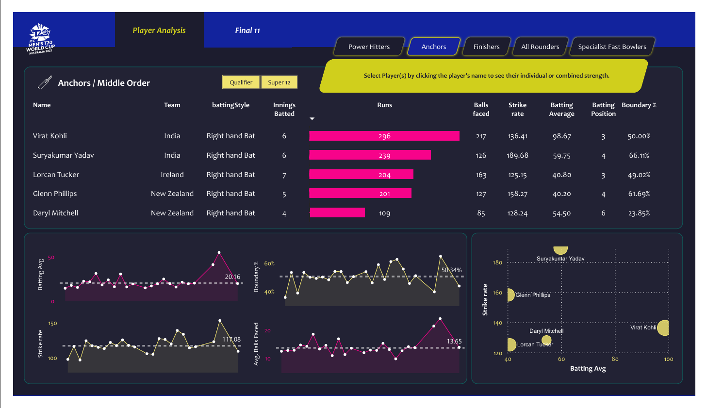
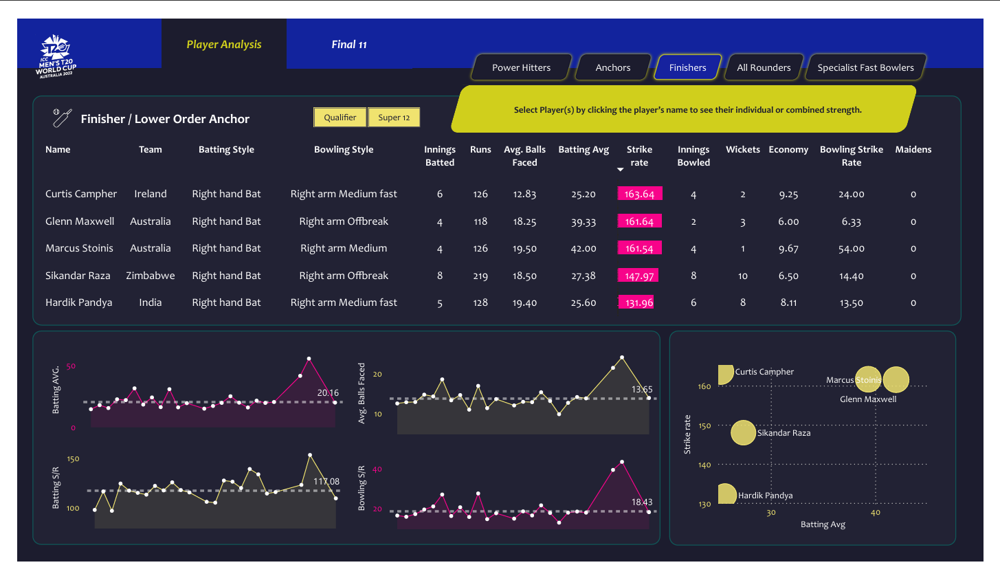
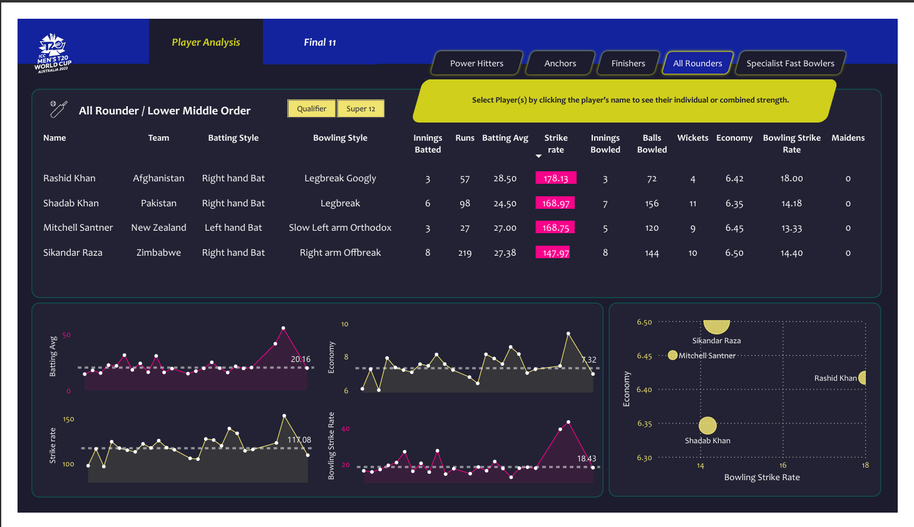
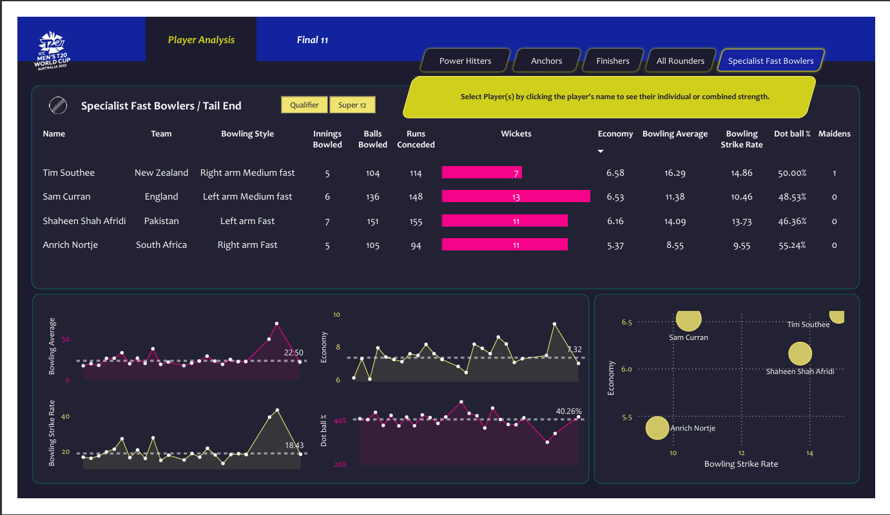
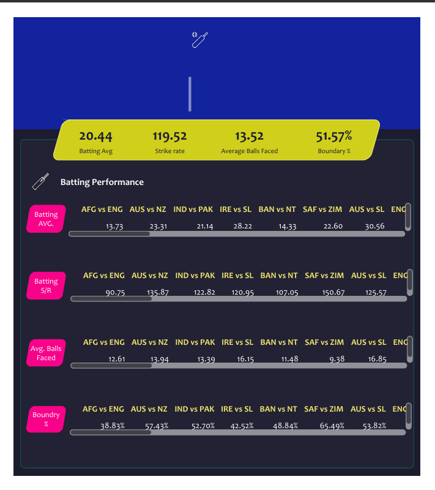
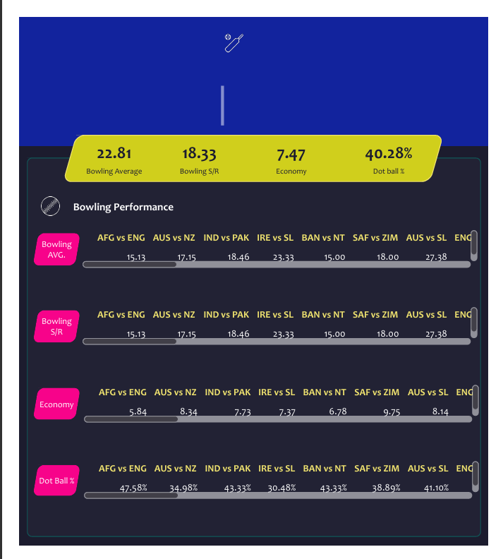

# Cricket Data Analytics🏏

---

The Cricket Data Analytics🏏 project is made on T-20 Cricket World Cup Data. I have used **Power BI** for making the Dashboard. We can easily analyse the data of the matches played in the world cup. We can also choose our best playing 11 from the pool of players playing the world cup. 

> To interact with the dashboard you can download the pbix file from the repository and open it in Power BI Desktop locally.

---

# Steps involved in the project:

1. 📝Requirement Scoping
2. 🌐Data Collection using Web Scraping from [ESPN Cricinfo](http://www.espn.in/cricket/) website
3. 🧹Data Cleaning and Preprocessing in Pandas
4. 🪄Data Transformation in Power Query
5. ⚒️Data Modelling and Building Parameters in Power BI using DAX
6. 📊Building the Dashboard in Power BI

---

# Screenshots of the Dashboard:

